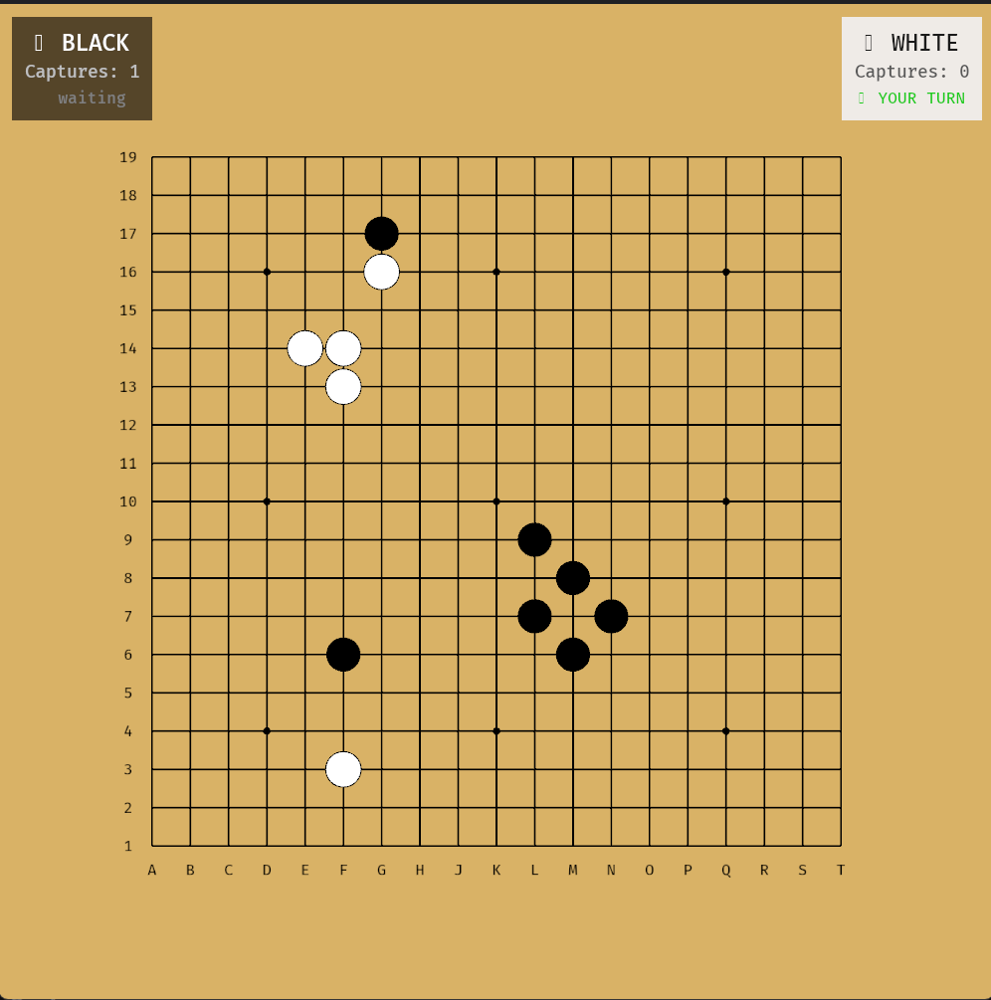

A fully playable, hardware-accelerated Go game built in Rust using the [Bevy Game Engine](https://bevyengine.org/).



## About
Rusty-Go is a desktop implementation of the ancient board game Go. It leverages the Entity Component System (ECS) architecture provided by Bevy (v0.18) to render a crisp, resizeable board with immediate input response.

This project was created to explore game development in Rust, transitioning from immediate-mode GUIs (egui) to full game engines (Bevy).

## ✨ Features
*   **Full 19x19 Board:** Includes standard visual guides like Star Points (Hoshi) and Coordinate labels (A-T, 1-19).
*   **Game Logic:**
    *   Alternating turns (Black goes first).
    *   **Capture Mechanics:** Implements Flood Fill algorithms to detect surrounded groups and remove them.
    *   **Suicide Rule:** Prevents placing a stone that would immediately result in self-capture (unless it captures the opponent).
*   **Visuals:**
    *   Filled stones with Z-indexing (Stones sit on top of grid lines).
    *   White stone outlines for visibility.
    *   Visual snapping to intersections.
*   **UI:** Real-time text display tracking captured stones for both Black and White.

### Prerequisites
You must have **Rust** and **Cargo** installed.
[Install Rust here](https://www.rust-lang.org/tools/install).

### Installation
1.  Clone the repository:
    ```bash
    git clone https://github.com/YourUsername/Rusty-Go.git
    cd Rusty-Go
    ```

2.  Run the game:
    ```bash
    cargo run --release
    ```
    *(Note: The first compilation might take a minute as it compiles the Bevy engine dependencies.)*

## 🎮 Controls
*   **Mouse:** Hover over intersections to aim.
*   **Left Click:** Place a stone.
*   **Rules:** Standard Go rules apply. Black moves first. Stones are removed when they have 0 liberties.

## 🛠️ Built With
*   [Rust](https://www.rust-lang.org/) - The programming language.
*   [Bevy 0.18](https://bevyengine.org/) - The Data-Driven Game Engine.

## 🗺️ Roadmap / Future Features
- [ ] Ko Rule implementation (prevent infinite loop captures).
- [ ] Game End detection (Two consecutive passes).
- [ ] Territory scoring algorithm.
- [ ] Sound effects for stone placement.
- [ ] Save/Load game state (SGF format).

## 📄 License
This project is licensed under the MIT License - see the [LICENSE](LICENSE) file for details.