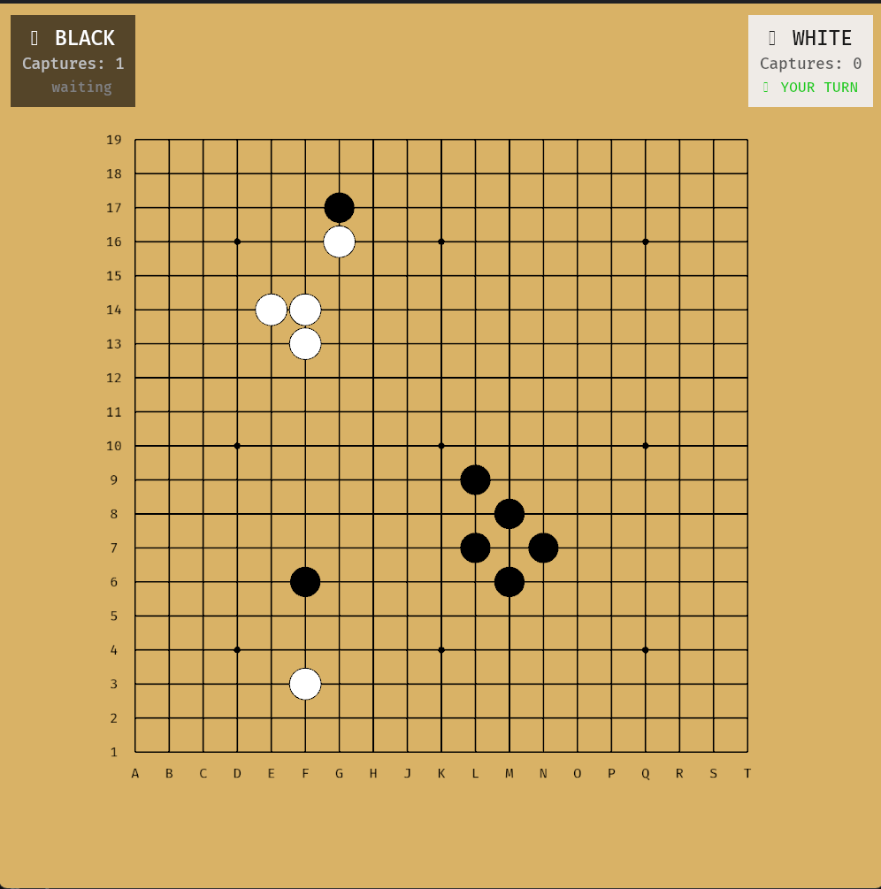

A fully playable, hardware-accelerated Go game built in Rust using the [Bevy Game Engine](https://bevyengine.org/).

## About
Rusty-Go is a desktop implementation of the ancient board game Go. It uses Bevy's (v0.18) Entity Component System to render a 19x19 board with real game rules — captures, suicide prevention, Ko, territory scoring, and proper game end detection.

This project started as an exploration of Rust game development, moving from immediate-mode GUIs (egui) to a proper game engine (Bevy).

## Features
*   **Full 19x19 Board** with Star Points (Hoshi) and coordinate labels (A–T, 1–19).
*   **Game Rules:**
    *   Alternating turns, Black goes first.
    *   **Capture mechanics** — flood fill detects surrounded groups and removes them.
    *   **Suicide rule** — can't place a stone that immediately self-captures (unless it takes opponent stones first).
    *   **Ko rule** — prevents immediately recapturing a single stone, stopping infinite loops.
    *   **Pass** — either player can pass their turn. Two consecutive passes end the game.
*   **Automatic Scoring (Japanese rules):**
    *   Territory counted by flood-filling empty regions and checking which color surrounds them.
    *   Captures and komi (6.5 for White) included in the final total.
    *   Game over screen shows the full breakdown and declares the winner.
*   **Visuals:**
    *   Stones with proper Z-layering over grid lines.
    *   White stone outlines for visibility against the board.
    *   Snap-to-intersection placement.
*   **UI:** Live capture counts and turn indicator for both players.

### Prerequisites
You need **Rust** and **Cargo** installed.
[Install Rust](https://www.rust-lang.org/tools/install)

*(First build takes a while — Bevy has a lot of dependencies.)*

## Controls
*   **Left Click** — place a stone on the nearest intersection.
*   **P** — pass your turn.
*   **R** — start a new game (available after the game ends).

## Built With
*   [Rust](https://www.rust-lang.org/)
*   [Bevy 0.18](https://bevyengine.org/)

## Roadmap
- [ ] Sound effects for stone placement.
- [ ] Save/Load game state (SGF format).
- [ ] Show shadow of possible moves
- [ ] Online multiplayer*.
